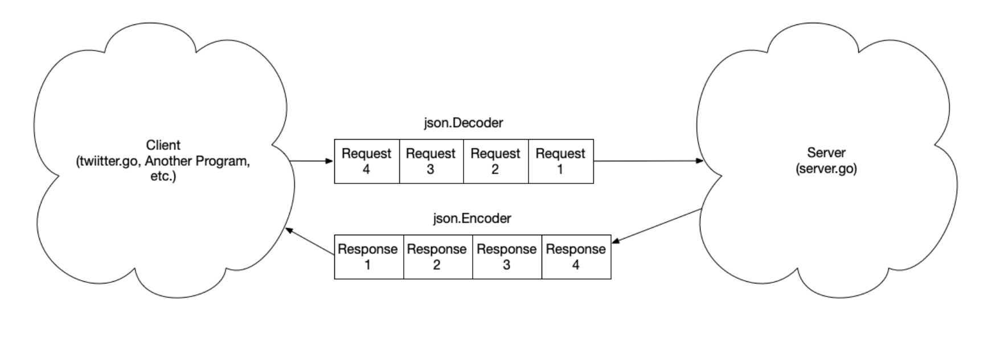
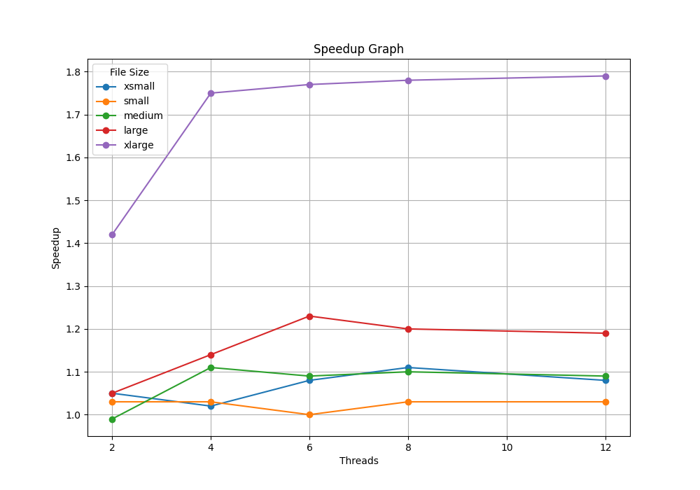

# Parallel Client/Server System

## Project Summary
The goal of the project is to create a Twitter-like client server system with multiple threads to receive feed requests, process tasks and send back responses to clients with the use and implementation of parallel data structures and primitives such as lock-free linked list, semaphore, mutex, read-write lock. Parallel program speedup performances from 2 to 12 threads are benchmarked against sequential program to assess how well the parallel program performs under different scenarios.



# Result Interpretation
Detailed time measurements are stored in *parserver/benchmark/slurm/out/speed.txt* 

Speedup graph is stored in *parserver/benchmark/speedup_graph.png*. 

Cluster node specs: 
* fast node
* 24 Cores (2x 24core Intel Xeon Silver 4116 CPU @ 2.10GHz), 48 threads
* 128gb RAM
* OS: 2x 240GB Intel SSD in RAID1
* /local: 2x 960GB Intel SSD RAID0 

## Speedup Graph


### General Interpretation
There is a positive relationship between file size and speedup. xlarge file (purple line) has clearly much higher speed up than large file (red line), which has higher speedup than the other smaller files (xsmall, small, medium). This is reasonable as there are larger portion of time that can be parallelized. There are always overheads such as setting up the requests, dequeuing them and putting them on a queue no matter the file is big and small. In smaller files, the overhead portion is likely to be higher, overshadowing the benefits of parallel programming. 

There is a positive relationship between number of threads and speedup, but there are diminishing marginal benefits. As seen in the graph, the lines are generally going up as the number of threads increase, demonstrating a positive relationship between number of threads and speedup. However, it is noted that there is clearly diminishing marginal speedup as the lines seem to be flattening soon as the number of threads increase. This scenario is in line with Amdahl's law as the sequential portion remains despite adding more threads, leading to diminising return in parallelism.

### Linked-list and Lock-free algorithm 
Linked-list queue is generally slow due to needing to lock the queue to prevent race conditions while a thread is iterating the list. Lock-free linked-list queue can help improve performance. For example, the lock-free queue implementation users compare-and-swap (CAS) operation rather than locks. When using lock, if a thread acquires the lock, other threads go to sleep and make no progress even if the thread in the critical section is taking a long time to execute. On the contrary, in CAS, as long as some thread is making a meaningful progress, then it will move to next iteration, guaranteeing some threads will make progress in each cycle. However, it is more complex to build a lock-free linked-list and involves more overheads and setup compared to normal linked list. 

### Areas of Performance Improvement
RW Lock is suitable if there are a lot more reads than writes. If the application is read-intensive, it is a good idea. However, if write is intensive, it is worth considering using regular mutex, which has less overhead and coordination, easier to implement and avoids write starvation. Also it is worth considering optimistic synchronization allowing multiple threads to concurrently perform operations with no locks, e.g. in scenarios where each user might be mostly interacting with their own feed. When things go wrong, just traverse the list twice. Alternatively, consider lazy synchronization like lazy list if there is a high proportion of contains operations. 

Currently, feed queue uses a RW lock, since locking causes the program to run slower, consider using a lock-free queue like the one used for the producer-consumer model implemented in later part. As mentioned above, due to use of CAS instead of lock, it guarantees that some threads can progress and there is no scheduler assumption / support. 

In terms of the Producer/Consumer model, one might consider balancing the number of producers vs consumers. The current implementation only uses 1 producer, if there are a lot of incoming requests, it will slow down the program runtime due to inability to parallelize processing incoming requests, having 1 producer means that consumers need to wait for producer to slowly decode the request and put it on the queue. Also, one might consider having consumers decoding the requests to save time as consumers are run in parallel, essentially we want to cut down the sequential portion of time. bottlenecked by number of threads allowed to run. Furthermore, the RW lock is limiting the number of reads to be 32. If there are a lot of threads waiting to read, it might hinder the performance. Consider resizing the number of threads allowed or perhaps not using RW lock but other mechanisms mentioned above. 

### Hardware Impact
The node used in this experiment has 24 cores and 48 threads. This helps improve performance as we are able to launch more go routines to run in parallel. Imagine if the node is a single core node with only 1 thread, no matter how we configure the parallel program, it will run like a sequential program. Some test cases uses 32 / 48 threads, with a hardware supporting 48 threads, we can launch the maximum threads possible to get the maximum performance we need based on the configuration, limited by Amdahl's law. 

Last but not least, the node has a large RAM. Having a high capacity main memory means that it is more likely to get cache hits, making the program to reduce I/O to disk and hence runs faster. 

## Code and directories

**benchmark** directory: 
* *benchmark-record-graph.sh* is the shell script to run on Linux cluster to measure the performances and generate speedup graphs. 
* *benchmark.go* measures and outputs the speed of execution of the respective program. 
* *graph.py* takes in performance data measured and creates a chart illustrating the speedup performance of parallel programs under different file sizes and different number of threads. 
* *speedup_graph.png* shows the speedup performance generated from *graph.py*.
* *slurm* is the directory that stores the output (out) and error (err) if any from jobs submitted to Linux cluster through *benchmark-record-graph.sh*.

**feed** directory: 
* *feed.go* stores the interface, structs, methods associated with feed and posts and tasks to perform in related to the feed and posts. 
* *feed_test.go* is used to test the correctness of the methods in feed.go

**test** directory: 
* *benchmark-parserver.sh* is the shell script to run *twitter/twitter_test.go* for testing the runtime of different jobs of various sizes and number of threads.
* *test-slurm.sh* is the shell script to run *test.go* on Linux cluster. 
* *test.go* tests the correctness of parallel runs of different jobs of various sizes and number of threads.
* *parserver-tests.json* is used to parse the requirements for computing the total score. 
* *slurm* is the directory that stores the output (out) and error (err) if any from jobs submitted to Linux cluster through *benchmark-parserver.sh* and *test-slurm.sh*.  

**lock** directory: 
* *rwlock.go* stores the struct and methods associated with read-write lock. 

**queue** directory: 
* *lockfree.go* stores the structs and methods associated with lock-free queue.

**semaphore** directory:
* *semaphore.go* stores the struct and methods associated with the implementation of semaphore. 
* *semaphore_test.go* tests the correctness of semaphore implementation.

**server** directory: 
* *server.go* implements the server mechanism for handling incoming feed requests, decoding requests and putting requests on the lock-free queue (producer), spawning go routines (consumers) to process the requests in parallel, encoding and sending back responses back to clients. Sequential processing is also implemented for benchmarking performance. 

**twitter** directory: 
* *twitter.go* is the entry point of the program, structuring the configuration requirements and passing it to the server. 
* *twitter_test.go* tests the runtime of different jobs of various sizes and number of threads.
* *tasks.txt* stores some simple requests testing. 

**other files**:
* *go.mod*, *go.sum* sets up the go program module. 
* *requirements.txt* specifies the Python libraries to install for the purpose of generating the speedup graph. 

## How to run the scripts
1. In *parserver* directory, run the following to set up Python virtual environment
```terminal
python -m venv parserverenv
```
2. Activate the virtual environment with the following
```terminal
source parserverenv/bin/activate
```
3. In *parserver* directory, run the following to install the Python libraries for generating graph. 
```terminal
pip install -r requirements.txt
```
4. For test benchmark performance, modify *benchmark-parserver.sh* accordingly and do the following. Results will be available in *test/slurm/out* directory. 
```terminal
cd test
sbatch benchmark-parserver.sh
```
5. For verifying completeness and correctness, modify *test-slurm.sh* accordingly and do the following. Results will be available in *test/slurm/out* directory. 
```terminal
cd test
sbatch test-slurm.sh
```
6. For measuring performance and generating the speedup graph, modify *benchmark-record-graph.sh* and *graph.py* accordingly and do the following. Results will be available in *benchmark/slurm/out* directory. 
```terminal
cd benchmark
sbatch benchmark-record-graph.sh
```
7. When ready to exit, run the following to deactivate the Python virtual environment 
```terminal
deactivate
```